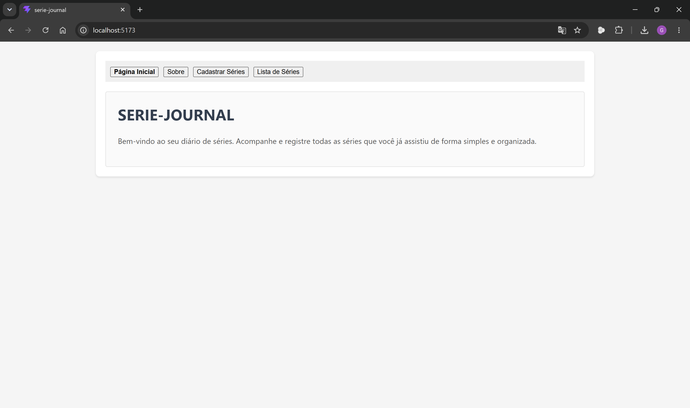
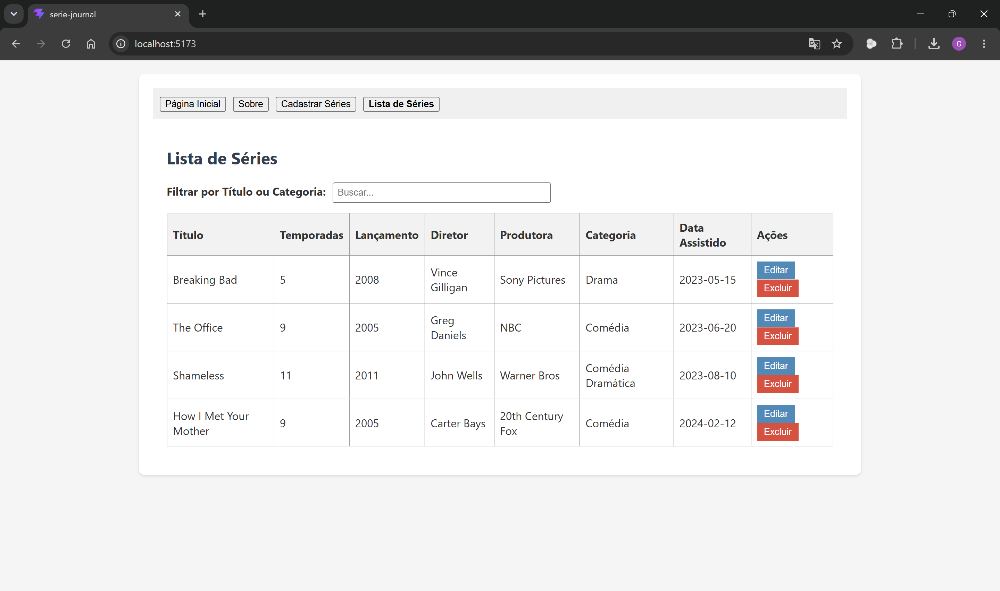
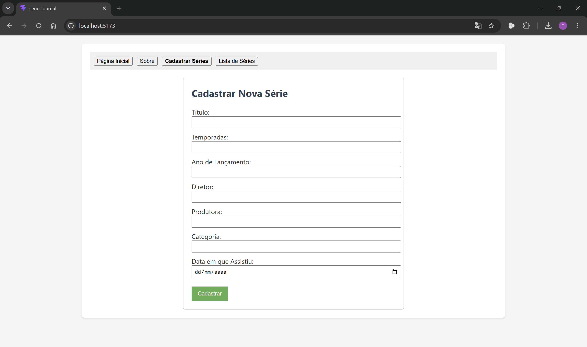
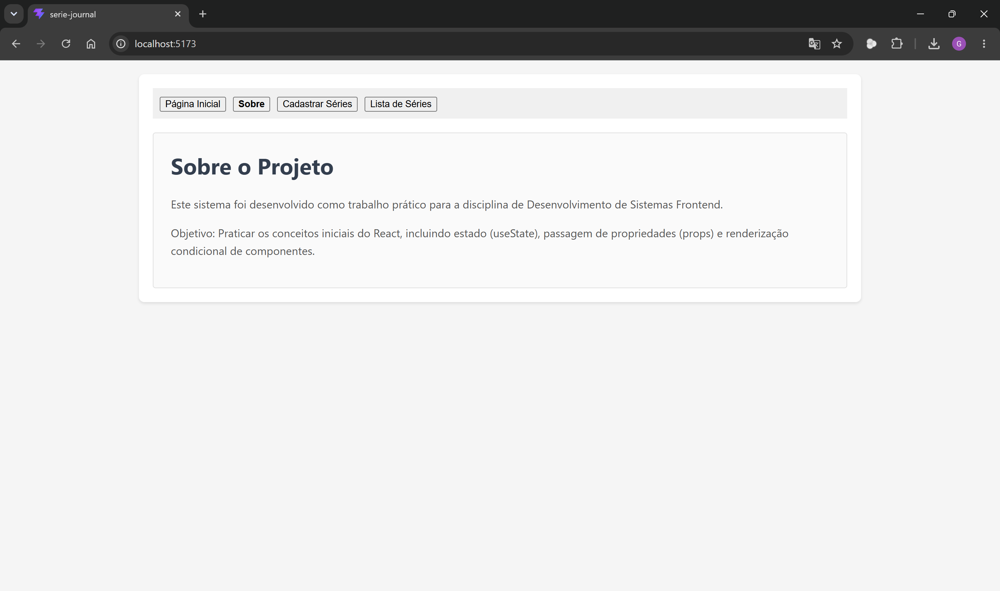

# SERIE-JOURNAL - Fase 1

Trabalho prático desenvolvido para a disciplina de **Desenvolvimento de Sistemas Frontend**.

**Aluno:** Gabriel Herculano Facchini

---

## Descrição do Projeto

O **SERIE-JOURNAL** é uma aplicação simples desenvolvida em React (utilizando o Vite) para catalogar e registrar as séries assistidas pelo usuário. Nesta Fase 1, o projeto utiliza estritamente conceitos básicos de React, como o gerenciamento de estados com `useState`, repasse de dados através de `props`, e renderização condicional dos componentes, sem uso de bibliotecas adicionais de gerenciamento de estado ou roteamento externo.

---

## Componentes do Sistema

* **App.jsx (Componente Principal):** Gerencia o estado global da aplicação (como a aba atual e o array de séries), detém os dados mockados iniciais e as funções de CRUD estático (`adicionarSerie`, `editarSerie` e `deletarSerie`), além de controlar a exibição condicional das páginas de acordo com a navegação.
* **NavBar (Navegação):** Barra superior contendo botões simples para navegar entre as seções: Página Inicial, Sobre, Cadastrar e Listar. Garante que, ao acessar a aba de cadastro direto, o formulário seja aberto limpo.
* **SerieForm (Formulário):** Componente de entrada de dados para cadastrar ou editar uma série. Possui validação interna para impedir o envio de campos em branco e detecta quando há uma série selecionada para edição, preenchendo automaticamente os campos correspondentes.
* **SerieList (Listagem):** Apresenta uma tabela estruturada contendo todos os 7 campos obrigatórios das séries assistidas. Possui um campo de filtro dinâmico no topo para buscar séries por título ou categoria e disponibiliza os botões individuais de 'Editar' e 'Excluir' para cada registro.

---

## Como Executar o Projeto Localmente

Siga o passo a passo abaixo para executar a aplicação em sua máquina:

1. **Extrair os arquivos:**
   Extraia todo o conteúdo do arquivo `.zip` enviado para uma pasta de sua escolha.

2. **Instalar Dependências:**
   Abra o terminal de comandos na pasta raiz do projeto extraído e execute o comando abaixo para baixar as dependências necessárias:
   ```bash
   npm install
   ```

3. **Executar em Modo de Desenvolvimento:**
   Após a conclusão da instalação, inicie o servidor local rodando o comando:
   ```bash
   npm run dev
   ```

4. **Acessar a Aplicação:**
   Abra o seu navegador e acesse o endereço retornado pelo terminal (geralmente `http://localhost:5173`).

---

## Demonstração Visual (Prints das Telas)

Insira as imagens geradas de cada tela nas pastas correspondentes ou ajuste os caminhos abaixo:

### Página Inicial (Home)


### Página de Listagem


### Formulário de Cadastro / Edição


### Página Sobre o Projeto

